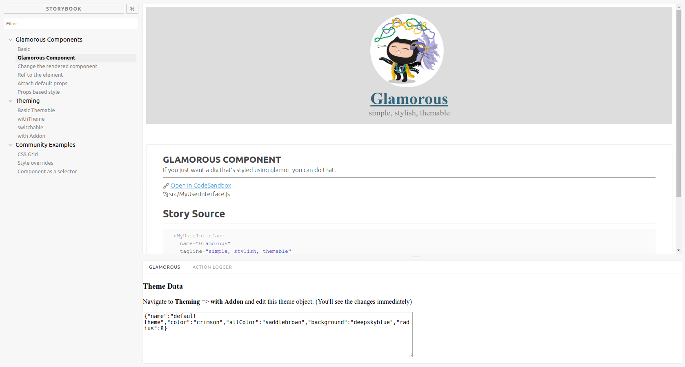

## Storybook & Glamorous

Here're some [glamorous](https://github.com/paypal/glamorous) examples from https://glamorous.rocks/ organized into a storybook.

Each expample goes in a separate story with description and has a link to `codesandbox.io` with the same source code

Check it out on github pages:
[](https://react-theming.github.io/glamorous-samples/)

### Usage

If you want to play with this examples:

```sh
git clone https://github.com/react-theming/glamorous-samples.git
cd glamorous-samples
npm i
npm start
```

It will launch the Storybook. Open in your browser http://localhost:9009
Navigate through the list of stories at the left panel. Each example has an annotation with short description and a name of source file (located in the `src` folder). Modify these files for better understanding of how the glamorous works. As you save the file, HMR will update the component and you'll see the result in your browser.

### Addon

This storybook contains additional example of a themable glamorous component. You can find it in Theming->with Addon. You can control theme data provided to this component via addon right in your browser. Find the 'Glamorous' panel at the bottom. When you edit the content of textarea (in JSON format) the component changes appropriately

### Preview


